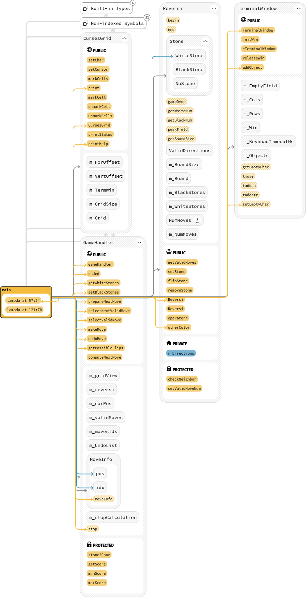
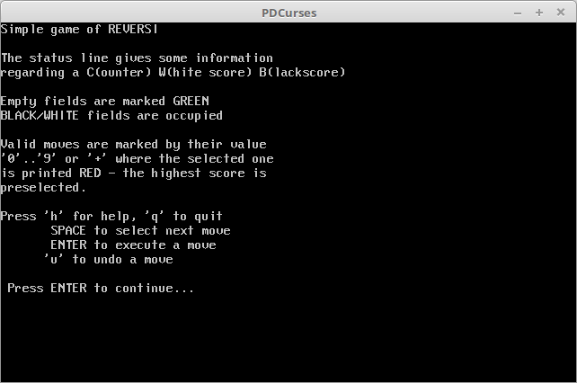
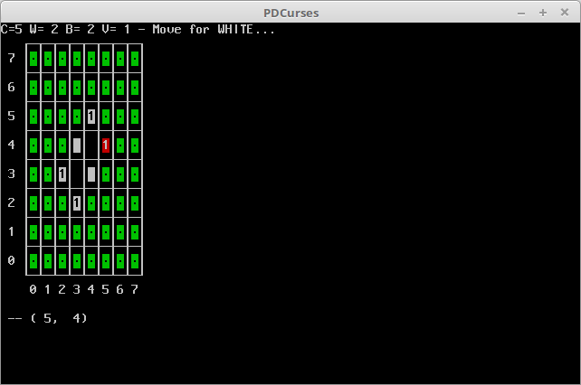
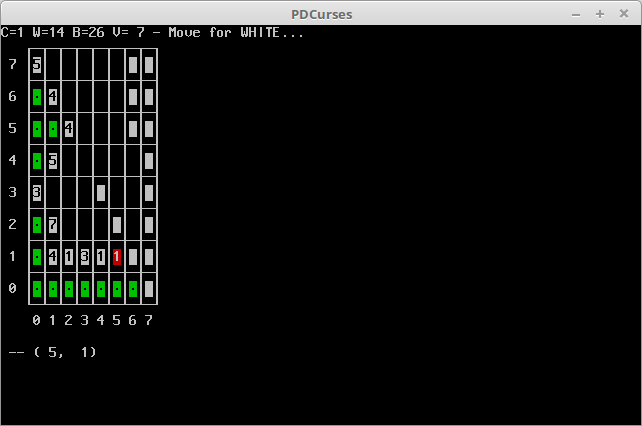
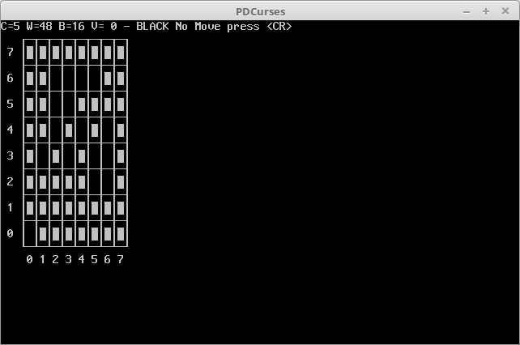

## Game of Reversi

This is a C++ implementation of the Reversi game, implemented on top of the public domain curses paket ***PDcurses***. It compiles and runs on Linux and Windows. All you need to build it, is a recent C++ compiler like g++, Clang or MSVC, plus CMake and PDCurses.

***Please have a look into the CMakeLists.txt build-script, since you will need to adapt the path to the pdcurses source and library locations.***

I've done this after a very inspiring interview, where I did not really have a reasonable idea of how to attack a game-project. - However, after some thinking - and reading as well - it turned out to be not so complicated.

The project contains only a handfull of classes:

- Graphical Display
  - TerminalWindow : General graphics via pdcurses
  - CursesGrid : Board display and handling
- Game Play
  - Reversi : General game implementation, not much logic here
  - GameHandler : Game logic: Moves, scores, move computation
- Data Structures
  - Pos_Vect : 2-dimensional vector, used for position and direction, simple vector arithmetic
  - QuadraticBoard : NxN board / matrix where N must be dividable by 2
  - FieldValue : Position on the board (possible move) together with list of captured stones for each valid direction
  - FieldList : List of FieldValue, used to hold all possible moves at a certain step of the game. Effectively containing all valid moves together with their values regarding captured stones.

Here is a class-diagram (generated by ***Sourcetrail***):

And here is how the game looks on linux, the welcome screen:

initial screen

here the "best move" computed indicates to place a white stone on field (5, 4).

after some moves

again, the computed best move recommends to play (5,1) even though just one black stone (6,2) is captured, while with (1,2) seven (!) stones would be captured by that move.

and finally

white won...

Please see the doxygen-generated html documentation for detailled information.